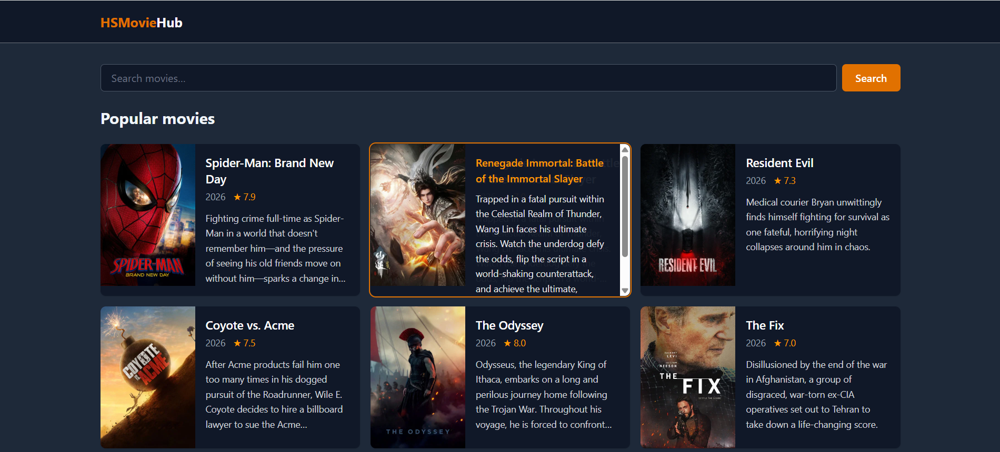
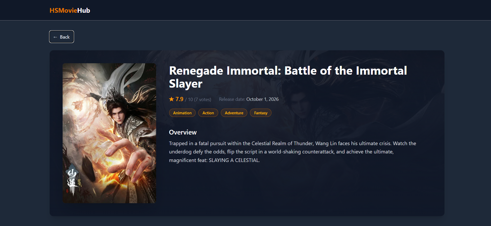
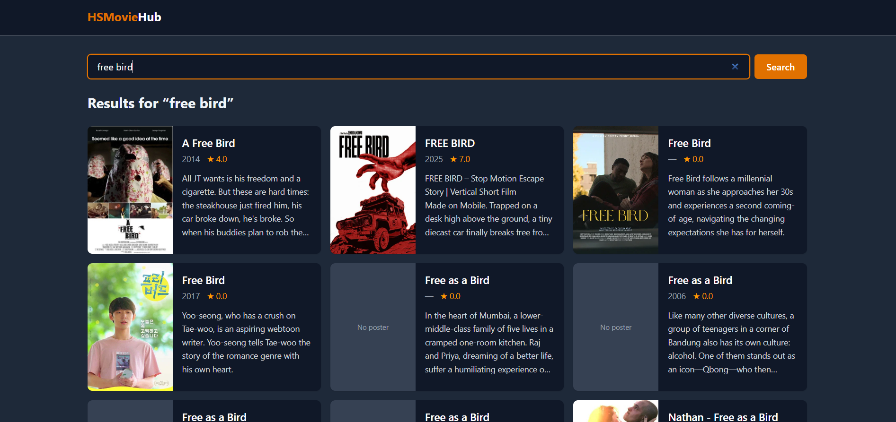
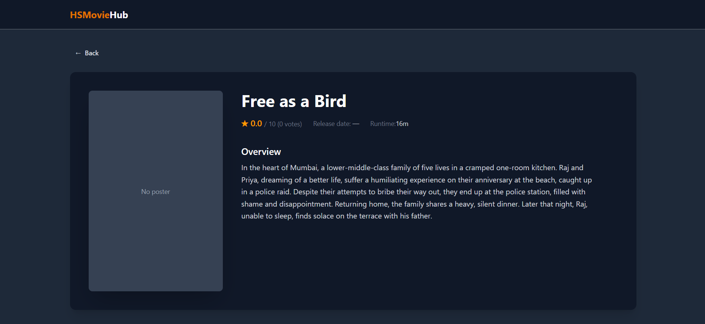
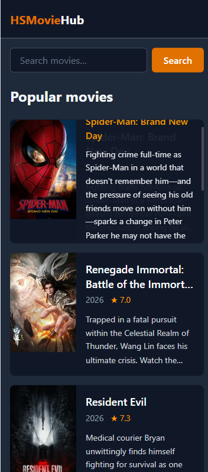
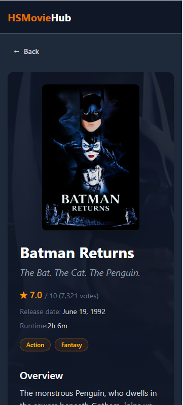
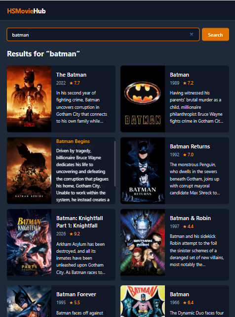
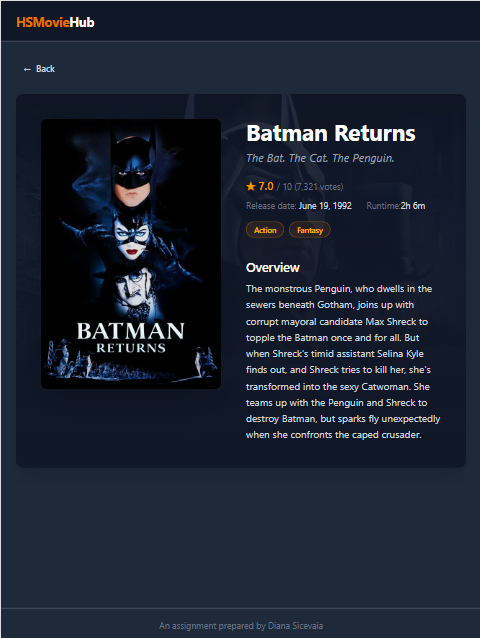
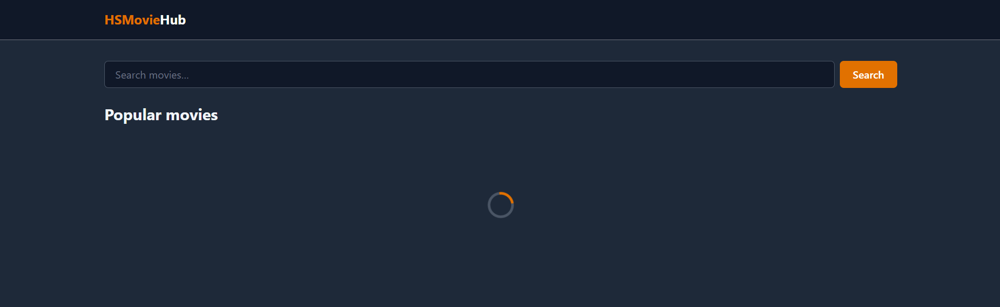
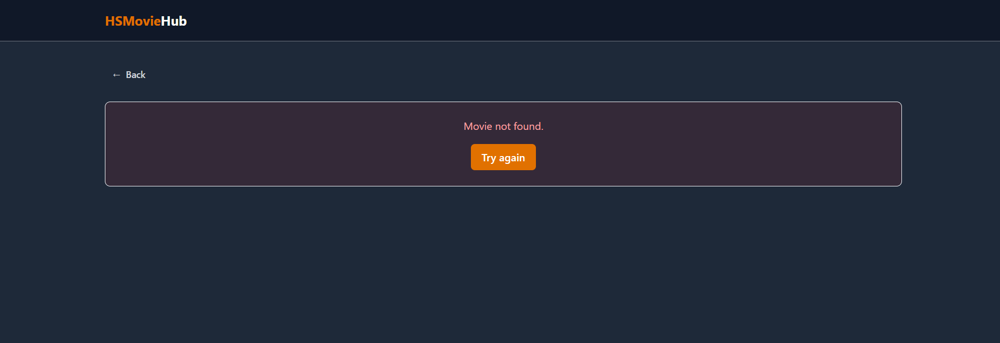

# HSMovieHub

A small web app for browsing and searching movies, built on **Angular 21** with data from [The Movie Database (TMDb) API](https://developer.themoviedb.org/docs).


**Live demo:** https://dianasicevaia.github.io/hs-test-movie-app/

## Features

- **Popular movies.** The home page shows a responsive grid of popular movies.
- **Movie cards.** Each card has the poster, title, release year, rating and a short overview.
  - On desktop, hovering a card shows the full overview.
  - On touch devices, long-pressing a card shows it.
- **Live search.** Results update while you type (debounced). The **Search** button or Enter searches immediately. Clearing the field brings back the popular list.
- **Movie details page.** Shows the poster, backdrop, title, tagline, overview, genres, rating, release date and runtime.
- **Smart "Back" button.**
  - It returns to the list with your search results and scroll position intact.
  - If the page was opened from a direct link, it goes to the home page instead of leaving the app.
- **Loading and error states.** Every request shows a spinner while loading. Errors show a readable message with a **Try again** button.
- **Responsive and accessible.**
  - The layout works from mobile to wide screens.
  - The app has keyboard focus styles, ARIA labels and screen-reader-only text.

## Screenshots

### Desktop

| Popular movies                                            | Movie details                                       |
| --------------------------------------------------------- | --------------------------------------------------- |
|  |  |

| Search results (incl. movie without poster)                           | Details without poster, short runtime                                           |
| --------------------------------------------------------------------- | ------------------------------------------------------------------------------- |
|  |  |

### Mobile & tablet

<table>
  <tr>
    <th>Mobile: long press on a card</th>
    <th>Mobile: details</th>
    <th>Tablet: long press in search results</th>
    <th>Tablet: details</th>
  </tr>
  <tr>
    <td></td>
    <td></td>
    <td></td>
    <td></td>
  </tr>
</table>

### Loading & error states

| Loading                                       | Movie not found (404)                    |
| --------------------------------------------- | ---------------------------------------- |
|  |  |

## Tech stack

| Area      | Choice                                                             |
| --------- | ------------------------------------------------------------------ |
| Framework | Angular 21: standalone components, zoneless change detection       |
| State     | Angular Signals: `signal`, `computed`, `linkedSignal`, `effect`    |
| Templates | Built-in control flow: `@if`, `@for`, `@else if`                   |
| Routing   | Angular Router with lazy-loaded routes and component input binding |
| HTTP      | `HttpClient` (fetch backend) with a functional interceptor         |
| Styling   | Tailwind CSS v4 (no component CSS files)                           |
| Async     | RxJS for debouncing and cancelling requests                        |
| Deploy    | GitHub Pages via `angular-cli-ghpages`                             |

## Getting started

### Prerequisites

- **Node.js** `^20.19`, `^22.12` or `>=24`
- A free **TMDb account** and its **API Read Access Token**

### 1. Install dependencies

```bash
npm install
```

### 2. Add your TMDb token

1. Go to [TMDb → Settings → API](https://www.themoviedb.org/settings/api).
2. Copy the **API Read Access Token**. It is the long one that starts with `eyJ...`, not the short API Key.
3. Create a `.env` file from the template:

```bash
cp .env.example .env
```

4. Paste the token into `.env`:

```dotenv
TMDB_API_URL=https://api.themoviedb.org/3
TMDB_ACCESS_TOKEN=eyJhbGciOi...
```

### 3. Run

```bash
npm start
```

Open http://localhost:4200.

> [!IMPORTANT]
> Use `npm start` / `npm run build`, not `ng serve` / `ng build` directly.
> The npm scripts first run `scripts/set-env.mjs`, which generates `src/environments/environment.ts` from `.env`.
> If you change `.env`, restart `npm start`.

## Scripts

| Command              | Description                                                |
| -------------------- | ---------------------------------------------------------- |
| `npm start`          | Generate env config and start the dev server on `:4200`    |
| `npm run build`      | Generate env config and make a production build in `dist/` |
| `npm run watch`      | Development build in watch mode                            |
| `npm run config:env` | Only regenerate `src/environments/environment.ts`          |

## Project structure

```text
src/app/
├── core/                         # App-wide singletons and non-UI code
│   ├── interceptors/
│   │   └── tmdb-auth.interceptor.ts   # Adds the Bearer token to TMDb requests
│   ├── models/
│   │   └── movie.ts                   # TMDb response types
│   ├── services/
│   │   └── movie.service.ts           # API calls + signal-based state
│   └── utils/
│       └── tmdb-image.ts              # Poster / backdrop URL helpers
│
├── features/
│   ├── movies/
│   │   ├── movie-list/                # Home page: search + grid + states
│   │   ├── movie-card/                # Single movie card
│   │   └── movie-search/              # Search input + button
│   └── movie-detail/                  # Movie details page
│
├── shared/
│   ├── directives/
│   │   └── long-press.directive.ts    # Long press for touch devices
│   └── ui/
│       ├── loading-spinner/
│       └── error-message/
│
├── app.config.ts                 # Providers: router, HttpClient, interceptor
├── app.routes.ts                 # Lazy routes: "" and "movie/:id"
└── app.ts / app.html             # Layout: header, router outlet, footer
```

## Implementation notes

### State with signals

`MovieService` keeps all state in private writable signals and exposes them as **read-only** signals, so components can only change state through service methods:

```ts
private readonly moviesSignal = signal<Movie[]>([]);
private readonly loadingSignal = signal(false);
private readonly errorSignal = signal<string | null>(null);

readonly movies = this.moviesSignal.asReadonly();
readonly loading = this.loadingSignal.asReadonly();
readonly error = this.errorSignal.asReadonly();
```

The list and the details page have **separate** state:

- Opening a movie doesn't wipe the list.
- Going back shows the results right away, without a new request.
- The current search keyword is stored in the service for the same reason.

### API methods

| Method                  | Endpoint             |
| ----------------------- | -------------------- |
| `getPopularMovies()`    | `GET /movie/popular` |
| `searchMovies(keyword)` | `GET /search/movie`  |
| `getMovieDetails(id)`   | `GET /movie/{id}`    |

`searchMovies('')` falls back to `getPopularMovies()`.

### Race conditions

Each new list or details request **cancels the previous one**. If you type quickly, a slow response for `"bat"` can't overwrite the results for `"batman"`.

### Search

`MovieSearchComponent` is a presentational component: it only emits the keyword.

- Typing is debounced (400 ms).
- Submitting with the button or Enter emits right away.
- `distinctUntilChanged` makes sure the same keyword is never sent twice.

### Route params as inputs

`withComponentInputBinding()` binds the `:id` route param straight to a signal input. `ActivatedRoute` is not needed:

```ts
readonly id = input.required({ transform: numberAttribute });
```

### API token

- The token lives in `.env`. Both `.env` and the generated `environment.ts` are git-ignored.
- A functional interceptor adds the `Authorization: Bearer` header **only** to requests going to the TMDb API.

> [!NOTE]
> This is a client-only app, so the token still ends up in the built JS bundle.

## Deployment

The app is deployed to GitHub Pages with [`angular-cli-ghpages`](https://github.com/angular-schule/angular-cli-ghpages):

```bash
npm run config:env
npx ng deploy --base-href=/hs-test-movie-app/
```

## Assignment checklist

- Latest stable Angular, standalone components
- Angular Signals for state and reactive data
- New template syntax: `@if`, `@for`
- `MovieService` with `getPopularMovies()`, `searchMovies()`, `getMovieDetails()`
- Loading and error signals, with both states shown in the UI
- Movie list with a separate card component: poster, title, overview
- Click on a card opens the details page via the router
- Search input + "Search" button, live filtering, popular list when cleared
- Details page: title, poster, overview, genres, rating, release date
- "Back" button
- Tailwind CSS for all styling
- Responsive layout

---

<a href="https://www.themoviedb.org"></a>

<sub>Attribution: Movie data and images are provided by <a href="https://www.themoviedb.org">TMDb</a>. This product uses the TMDb API but is not endorsed or certified by TMDb.</sub>
